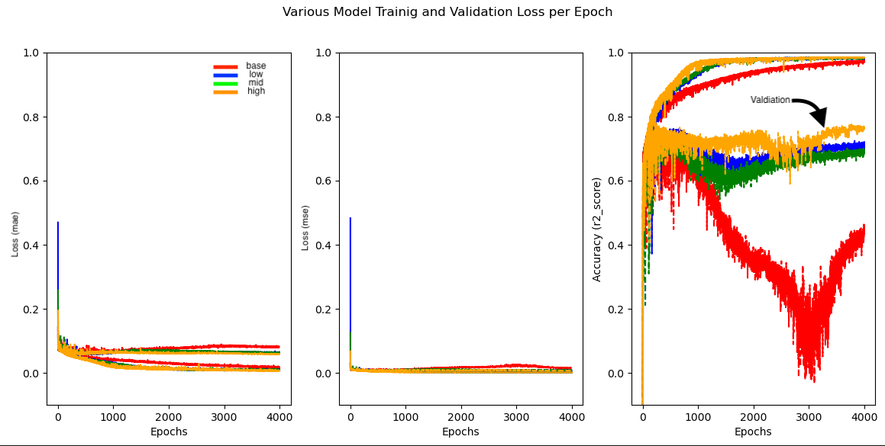
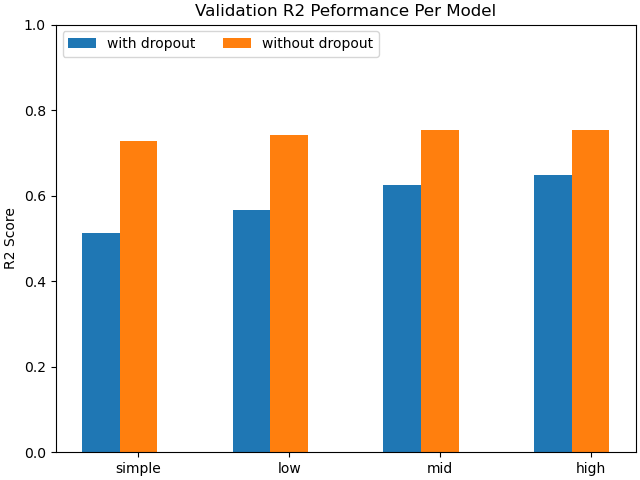

# Voting Prediction Regression with Neural Network

This study examines the predictability of US county-level presidential election outcomes using 2020 socioeconomic and demographic data sourced from the American Community Survey.
A dataset of 2,305 counties was constructed by joining voting records, socioeconomic, and demographic tables on FIPS codes, yielding 146 normalized features.
Correlation analysis reveals that advanced degree attainment and minority population counts are the strongest predictors of Democratic outcomes,
while White-alone population and lower formal education credentials dominate Republican signal.
Four sequential neural network architectures were evaluated, with a three-layer hourglass design (compress-then-expand hidden layers) achieving the best performance at R² = 0.754 and MSE = 0.00619
Results suggest that the current feature set has reached an information ceiling, and that future gains are more likely to come from feature engineering

## 1. Dataset

The dataset combines 2020 US county-level voting records, socioeconomic data, and demographic data, joined on FIPS codes and resulting in 2,305 counties and 146 features.
A prediction target was created as the ratio/percent of the Democrat party voting share for the presidential election of year 2020. All features were normalized based
on the total per county provided within the raw dataset. 

### Data Sources

Three datasets were collected and joined at the US county level using FIPS codes:

| # | Dataset | Scope |
|---|---------|-------|
| 1 | Voting records — US Presidential Elections | 2000–2024, county level |
| 2 | Socioeconomic data — US Counties | Year 2020 |
| 3 | Demographic data — US Counties | Year 2020 |

#### Correlation on Demographic Vote Share

Top 5 Correlation

| Feature | Correlation |
|---------|------------|
| Total Master's degree | 0.588 |
| Total Professional school degree | 0.562 |
| Total Doctorate degree | 0.453 |
| Total Asian alone | 0.440 |
| Total Bachelor's degree | 0.430 |

Bottom 5 Correlation (Negative)

| Feature | Correlation |
|---------|------------|
| Total White alone | -0.546 |
| Total Regular high school diploma | -0.438 |
| Total Some college, less than 1 year | -0.301 |
| Total Income ≥ poverty level — Male 75 years and over | -0.275 |
| Total Male 80 to 84 years | -0.272 |


#### Feature Variances

Most Varied

| Feature | Std Dev |
|---------|---------|
| Median household income (2020 inflation-adjusted) | 0.2592 |
| Total White alone | 0.1538 |
| Total Black or African American alone | 0.1248 |
| Total In labor force — Civilian — Employed | 0.0803 |
| Total Not in labor force | 0.0777 |

Least Varied

| Feature | Std Dev |
|---------|---------|
| Total Income ≥ poverty level — Male 15 years | 0.00279 |
| Total 4th grade | 0.00273 |
| Total Income ≥ poverty level — Female 5 years | 0.00272 |
| Total Income ≥ poverty level — Female 15 years | 0.00268 |
| Total 2nd grade | 0.00257 |


## 2. Model Architecture
Four sequential neural network architectures were trained and evaluated on predicting county-level Democrat vote share using 146 normalized socioeconomic and demographic features.
All models use the same input/output structure — only the hidden layers differ. `F` = `feature_size` = 146.
The models were trained with dropout (rate 0.3) and without dropouts for 2000 epochs each with learning rate of 0.001. It was found that training the models without dropout resulted in
better performance, indicating healthy variance and well diverging dataset. Additionally, all models peaked in performance around epoch 800 and all models, but the baseline,
model saw significant drop in performance beyond epoch 1500. 


### Model 1 — Baseline
```
Input(F) → Dense(F) → Dense(F, softplus) → Dense(1)
```

### Model 2 — Compressed (Low)
```
Input(F) → Dense(F) → Dense(F/2, softplus) → Dense(F/2, softplus) → Dense(1)
```

### Model 3 — More Layers (Medium)
```
Input(F) → Dense(F) → Dense(F, softplus) → Dense(F/2, softplus) → Dense(F, softplus) → Dense(1)
```

### Model 4 — High Width (High)
```
Input(F) → Dense(F) → Dense(2F, softplus) → Dense(F, softplus) → Dense(F/2, softplus) → Dense(F, softplus) → Dense(1)
```

### Model and Training Summary

| Setting | Value |
|---------|-------|
| Input features | 146 (normalized) |
| Target label | Democrat votes / Total votes |
| Optimizer | Adam, learning rate = 0.001 |
| Loss function | Mean Squared Error (MSE) |
| Epochs | 2,000 |
| Validation | Train/test split with checkpoint on best validation epoch (70/30) |
| Hidden activation | `softplus` |
| Output activation | None, linear output |



#### Training Results - Validation Accuracy, R-Squared


| Model | Dropout R² | No Dropout R² | MSE (loss) |
| --- | --- | --- | --- | 
| Single | 0.5125 | 0.7284 |  0.006851 | 
| Low | 0.5665 | 0.7410 | 0.006534 |
| Medium | 0.6246 | 0.7544 |  0.006194 |
| High | 0.6477 | 0.7544 | 0.006195 |




## 3. Neural Network Layer Weights and Bias Analysis

Classic regression models followed the correlation found during EDA as expected. The higher performing models such as Decision Tree and Gradient Boosting models captured racial and education related features, 
while linear and ridge regression captured more around the income levels. 

Although, weights of neural networks cannot be analyzed in the same way as classic regression, it still offers interesting insights into the model performance. The connection of each layers essentially formulate a "permutation"
of observable patterns, which provides more insights on the interaction between the features rather than their direct individual impact. As expected, the input layer of all models (size of 146 by 146) had their "top features"
evenly distributed among all features. However, on purely ranked analysis (which is still arbitrary) of the model weights of the input layer, the top 5 highest weight features across all models were features that were among the least correlated and
least varied. Interestingly, a similar analysis of the decision layer showed that the highest weights were generally associated with male demographic while the lowest were associated with female demographic. 
This could indicate a neural network finding a pattern of families within the demographic data since a household is likely to align their political standings. 

### Previous Work - Classic Regression Methods

| Model | Feature 1 | Feature 2 | Feature 3 | Feature 4|
| --- | --- | --- | --- | --- |
| Linear | Not in labor force | Total population | Employed, civilian | In labor force, civilian |
| Ridge | Not in labor force | Total male 20yrs | In labor force, civilian | Employed, civilian |
| Decision Tree | Has Dr. Degree | Total White population | Has professional degree | Has higher education |
| Random Forest | Total White population | Has Dr. Degree| Has higher education | Total single Asian population |
| Gradient Boosting | Total White population| Has higher education | Has Dr. Degree | Total single Asian population |


### Neural Network Results

### Input Layer
Most commonly occuring highest weight features across all models

1. Total American Indian and Alaska Native alone
2. Total Income in the past 12 months below poverty level Female 35 to 44 years
3. Total Income in the past 12 months below poverty level Male 15 years
4. Total Income in the past 12 months below poverty level Female 55 to 64 years
5. Total Native Hawaiian and Other Pacific Islander alone

All layers/models showed that the top weights are even distributed, showing that the embedding space is evenly distributing permutation of all feature types

### Decision Layer

**NOTEL:** All income data is for past 12 months(2019-2020)

Highest Weight Features

| Model | Feature 1 | Feature 2 | Feature 3 | Feature 4|
| --- | --- | --- | --- | --- |
| Single | Employed, civilian | Total 1st grade population | Total Female 35-39yrs | Total income below poverty past 1 year, male |
| Low | Total male 25-29yrs | Total female 67-69yrs | Total 7th grade | Total male >= 85yrs |
| Medium | Total female 5-9yrs | Total Nursery | Total male 22-24yrs | Total male 67-69yrs |
| High | Total income above poverty, male 12-14 yrs | Total single native Hawaiian/Pacific Islander | Total 4th grade | Total income above poverty, male 55-65 yrs |

Lowest weight features

| Model | Feature 1 | Feature 2 | Feature 3 | Feature 4|
| --- | --- | --- | --- | --- |
| Single | Total income above poverty, female 25-34yrs | Total female population 20yrs | Total Bachelor's Degree | Total income below poverty, male 25-34 years |
| Low |  | Total single White | Total female, 20yrs | Total 9th grade | Total female, 75-79yrs |
| Medium | Total male 25-29yrs | Total no school | Total male 60-61yrs | Total 3rd grade |
| High | Total income below poverty, female 16-17yrs | Total income below poverty, female 45-54 | Total labor in armed forces | Total income above poverty, female 55-64yrs |


## 4. Conclusion

The best-performing architecture, a three-hidden-layer hourglass network (F → F/2 → F), achieveed R² = 0.754 and MSE = 0.00619, explaining roughly 75% of county-level vote share.
A wider four-layer variant matched this score, indicating the limit on diminishing returns of adding parameters to the neural network. All regression, classic and neural networks peaked around
75% accuracy, showing that the prediction variance is likely reaching the limit of the dataset and impact of variable outside of the training dataset such as 3rd party votes.

Although layer weight analysis cannot be performed like a feature importance analysis of classic machine learning models, the analysis of layer weights (especially the decision layer)
provide interesting insights to the hidden layer interaction. The medium (best performing) and high parameter count models showed parity between male and female demographics between
features with highest and lowest weights. This could indicate interactions of features that shows families within the demographic dataset showing the likelihood of families having aligned
political views. 